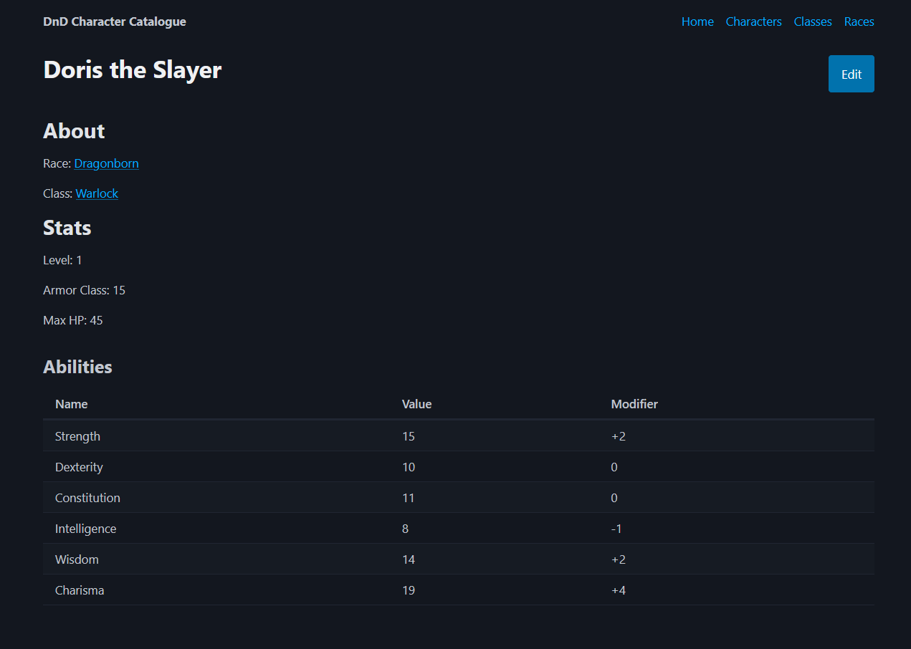

# DnD Character Catalogue

Generate, save and edit your characters for your Dungeons and Dragons campaign using this simple web application built using Django.

## Features

- List of basic DnD classes with descriptions of each class.
- List of basic DnD races with descriptions and base stats of each race.
- Create and Edit character forms to manage your characters.
- Character view showing all the stats and information of that character.

## Running the Application

> Prerequisites:
>
> - [Astral's UV](https://docs.astral.sh/uv/): Python package manager

1. Clone the repository.
2. Run the Django app using `uv run manage.py runserver`.
3. Open the web application in your browser at `http://127.0.0.1:8000/`.

## Resources

- [Django](https://www.djangoproject.com/): Python Web Framework
- [picocss](https://picocss.com/): CSS Framework for the front-end
- [Ruff](https://docs.astral.sh/ruff/): Python linter and formatter
